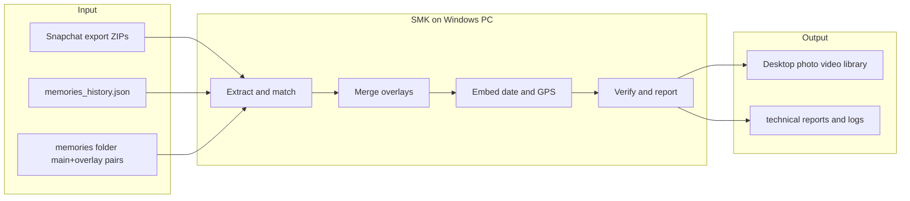
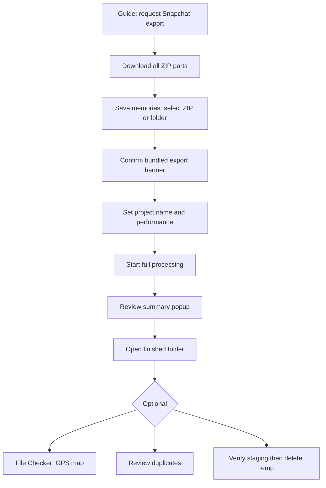
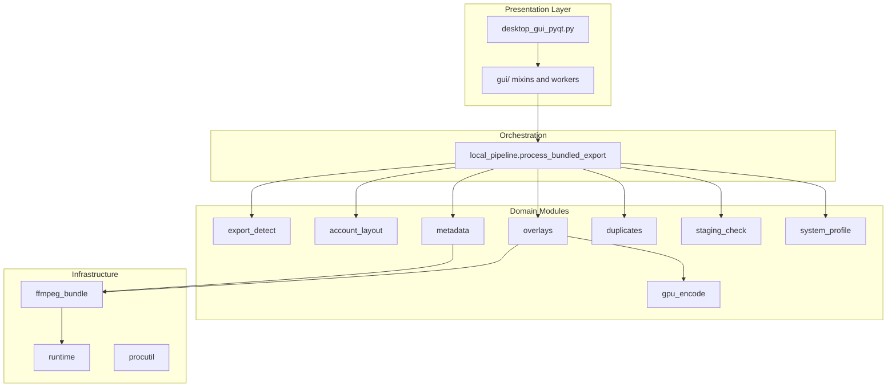

# SMK — Comprehensive Briefing (CEO · PM · Developer)

Product briefing for SMK v1.0.0. Documents the product as built today.

---

## Executive summary (all audiences)

**Snapchat Memories Keeper (SMK)** is a **Windows desktop application** that converts Snapchat’s official “Download My Data” export into a **normal, local photo/video library** — with filters merged back in, capture dates embedded, GPS preserved, and safe resume on large exports. Processing is **offline**, **local-only**, and **not affiliated with Snap Inc.**

- **Author:** Las HS · **Version:** 1.0.0 · **License:** GPLv3 (PyQt5 linkage)
- **Distribution:** Portable `SMK.exe` folder via PyInstaller (+ optional Inno Setup installer)
- **Primary user:** Someone who requested a Snapchat Memories export and wants usable files on their PC without cloud upload

---

# Part 1 — For a CEO

## What problem exists in the market

Snapchat lets users export Memories, but the export is **not a finished photo library**:

| User expectation                     | What Snapchat delivers                                |
| ------------------------------------ | ----------------------------------------------------- |
| Photos/videos that look like the app | Separate `-main` media + `-overlay.png` filter layers |
| Files sorted by when taken           | Dates mostly in JSON, not always in file metadata     |
| GPS on a map in Photos/Google        | Coordinates in JSON, often missing from files         |
| One folder, open anywhere            | Multi-part ZIPs, technical folder names, no resume    |
| Privacy                              | Cloud converters require uploading personal snaps     |

This creates demand for a **trust-first, offline converter** — especially after Snapchat’s **2026 bundled export** (media inside ZIP, no CDN links).

## What SMK is (business terms)

SMK is a **single-purpose desktop utility** in the **personal data portability / digital preservation** category. It is not a social app, not a Snapchat client, and not a subscription service.

**Value proposition:** *Turn an opaque Snapchat export into a permanent personal media archive on the user’s own disk — without sending data to a third party.*

## Strategic positioning

**Strengths vs alternatives**

- **vs cloud “Snap export tools”:** No upload; GDPR/privacy-friendly story; works air-gapped after ZIP download
- **vs manual unzip/rename:** Automated overlay merge, metadata, collision-safe naming, resume, verification
- **vs generic EXIF tools:** Built for Snapchat’s exact export structure (multi-ZIP, main/overlay pairs, JSON schema)
- **vs Snap’s own UX:** Snap does not ship a “restore to normal library” product — SMK fills that gap

**Honest limitations (risk register)**

| Risk                          | Business impact              | Mitigation                                         |
| ----------------------------- | ---------------------------- | -------------------------------------------------- |
| Not affiliated with Snap      | Trademark/policy scrutiny    | Clear disclaimers; no Snap branding misuse         |
| Windows-only official support | Limits TAM                   | Acceptable for v1; community ports possible        |
| Unsigned installer            | SmartScreen friction         | SHA-256 checksums; code signing when budget allows |
| Link-only exports unsupported | Some users blocked           | Clear UX: request bundled export from Snapchat     |
| My Eyes Only excluded         | Support complaints           | Documented in Guide/Help/About                     |
| Solo maintainer               | Bus factor, velocity         | Open source on GitHub; donation/support model      |
| GPLv3                         | Commercial reuse constraints | Aligns with PyQt; limits proprietary forks         |

## Business model (current)

- **Free to use** — no paywall
- **Optional tips:** PayPal, Ko-fi, Liberapay (via Support menu / About)
- **Free support path:** GitHub star / issues
- **Not enterprise SaaS** — no telemetry, no accounts, no recurring revenue engine today

## Trust and compliance narrative (sellable to users/regulators)

- **No telemetry** — no analytics phone-home
- **Local processing** — export never leaves the machine (except optional map tile loads in File Checker)
- **Transparent technical folder** — power users can audit `technical/reports/`
- **User-controlled destructive actions** — duplicate deletion is explicit; staging delete gated on verification

## Target market (pragmatic)

- Snapchat users with **years of Memories** doing a **one-time or occasional archive**
- Privacy-conscious users refusing cloud converters
- Windows home users (10/11 64-bit) — not IT departments (yet)

**TAM is hard to quantify** (Snap does not publish export volumes), but the wedge is: *every user who exports Memories and finds the ZIP unusable.*

## Investment / resource lens

If you were funding this as a product:

| Area               | Current state                                  | CEO question                                         |
| ------------------ | ---------------------------------------------- | ---------------------------------------------------- |
| Product-market fit | Strong for 2026 bundled exports                | Validate with support tickets / GitHub stars         |
| GTM                | GitHub + word of mouth                         | Needs installer polish, signing, landing page        |
| Ops cost           | Near-zero (no servers)                         | Maintainer time only                                 |
| Scale              | Single-machine parallel processing             | Bottleneck = user’s CPU/disk, not cloud              |
| Moat               | Domain expertise + offline trust + open source | Weak vs well-funded clone; strong vs generic scripts |

## Roadmap at executive level ([README.md](../README.md))

- **Phase A — Stability:** crashes, path portability, stat correctness, metadata integrity
- **Phase B — UX clarity:** status, reporting, beginner language
- **Phase C — Visual polish:** after behavior is stable

## CEO one-liner

> **SMK is a privacy-first Windows utility that unlocks the personal value trapped inside Snapchat’s data export — turning a technical ZIP archive into a lifetime photo library the user actually owns.**

---

# Part 2 — For a Project Manager

## Product scope (in / out)

**In scope (v1.0.0)**

- Import bundled Snapchat export (single or multi-part ZIP)
- Extract, match JSON to files, merge overlays, embed metadata
- Output to user-chosen Desktop folder (default simple layout)
- Checkpoint resume; quarantine bad files; processing reports
- Post-run: duplicate review, staging verification, File Checker scan/map
- In-app Guide, Help, About; theme support; performance presets

**Out of scope (explicit)**

- Downloading from Snapchat API / logging into Snapchat
- Link-only (CDN URL) exports
- My Eyes Only content
- macOS/Linux/mobile official builds
- Cloud sync, accounts, multi-user admin

## User personas

| Persona                  | Goal                               | Success criteria                                          |
| ------------------------ | ---------------------------------- | --------------------------------------------------------- |
| **First-time archivist** | “Save my snaps before I lose them” | Completes Guide → export → one Start click → folder opens |
| **Power user**           | Control, audit, disk management    | Technical view, staging verify, reports, duplicate pick   |
| **Troubleshooter**       | Fix failed/partial run             | Resume works; Help explains; About shows ffmpeg status    |
| **Privacy advocate**     | No cloud                           | Offline badge; no telemetry copy                          |

## Primary user journey (happy path)

## Feature map by tab

| Tab               | Features                                                       | Dependencies                |
| ----------------- | -------------------------------------------------------------- | --------------------------- |
| **Guide**         | Export request walkthrough, screenshots                        | Static HTML                 |
| **Save memories** | ZIP import, perf modes, processing, duplicates, staging verify | ffmpeg, Pillow, pipeline    |
| **File Checker**  | Extension scan, metadata panel, GPS map                        | folium, PyQtWebEngine (map) |
| **Help**          | Full troubleshooting docs                                      | Static HTML                 |
| **About**         | Version, privacy, system status, support links                 | Runtime probes              |
| **Palestine**     | Advocacy content (separate from core product)                  | Static                      |

## Output deliverables (what “done” looks like)

**User-facing artifacts**

- `merged/` — final photos/videos with overlays + metadata
- Optional `raw/` — unfiltered copies
- Human-readable filenames: `YYYY-MM-DD_HH-MM-SS.jpg` (+ collision suffix)

**Technical artifacts** (under `%LOCALAPPDATA%\SnapchatMemoriesDownloader\accounts\<project>\technical\`)

- `staging/` — extracted source media (large; deletable after verify)
- `reports/` — processing, collisions, duplicates, session reports
- `checkpoint/local_checkpoint.json` — resume state
- `quarantine/` — suspect tiny/corrupt files
- `logs/`, `debug/`

**Disk planning:** ~2–3× export ZIP size during processing (staging is the main cost).

## Non-functional requirements

| NFR         | Target                              | Notes                        |
| ----------- | ----------------------------------- | ---------------------------- |
| Privacy     | No telemetry                        | Verified by design           |
| Offline     | Core pipeline offline               | Map tiles optional network   |
| Resume      | Checkpoint every ~25 items          | Test cancel/crash scenarios  |
| Performance | Adaptive workers by CPU/RAM/battery | Maximum / Balanced / Eco     |
| Reliability | Staging verify before delete        | Prevents data loss           |
| Portability | Single EXE folder                   | PyInstaller + bundled ffmpeg |

## Release checklist (from [PRE_PUBLISH.md](PRE_PUBLISH.md))

Critical gates before public release:

- Full bundled export tested (maintainer used 13k+ file export)
- Verify staging passes before deleting staging
- Resume after cancel tested
- Clean Win10/Win11 VM without Python
- ffmpeg shows “bundled” in About
- SHA-256 published for binaries; FFmpeg LGPL notice included
- LICENSE (GPLv3) and NOTICE files present

## Known gaps / backlog (PM backlog candidates)

- UI polish still PyQt5-native (not modern SPA-level)
- SmartScreen without code signing
- HEIC/WebP viewer quirks on Windows
- Link-only export unsupported (may need clearer pre-flight detection UX)
- Duplicate deletion is **permanent** — needs strong UX confirmation (already intentional)
- Documentation split across Help (user) and agent-docs (maintainer)

## Success metrics (suggested — not instrumented today)

Because there is **no telemetry**, PM metrics must be **external**:

- GitHub stars / forks / issue volume
- Download counts (release assets)
- Support questions themes (export type, ffmpeg missing, resume)
- Donation conversion (optional)
- Qualitative: “processed N memories without re-download” testimonials

## Risks and mitigations (PM register)

| ID  | Risk                           | Likelihood | Impact   | Mitigation                                                                        |
| --- | ------------------------------ | ---------- | -------- | --------------------------------------------------------------------------------- |
| R1  | User deletes staging too early | Medium     | High     | Gated delete + verify tool                                                        |
| R2  | Wrong JSON↔file match          | Low        | Critical | Deterministic matching + tests + staging check uses same logic                    |
| R3  | Video quality regression       | Medium     | Medium   | CRF 16 profile; GPU fallback chain                                                |
| R4  | Export format change by Snap   | Medium     | High     | Export classifier in [smd/export_detect.py](../smd/export_detect.py); monitor issues |
| R5  | Legal/trademark                | Low        | High     | Disclaimers; no Snap impersonation                                                |

## PM one-liner

> **SMK is a offline Windows workflow product: import Snapchat ZIP → resumable local pipeline → verified library on Desktop, with explicit trust/privacy positioning and a phased roadmap from stability to polish.**

---

# Part 3 — For a Software Developer

## System overview

**Architecture pattern:** Thin GUI shell + **importable backend package** (`smd/`) + pytest suite without Qt.

## Entry points

| Entry   | File                                       | Role                                                |
| ------- | ------------------------------------------ | --------------------------------------------------- |
| GUI     | [desktop_gui_pyqt.py](../desktop_gui_pyqt.py) | PyInstaller target; `DownloaderGUI` composes mixins |
| CLI     | [main.py](../main.py)                         | Argparse → `process_bundled_export()`               |
| Backend | [smd/](../smd/)                               | All processing logic; unit-tested without GUI       |

## Core pipeline ([smd/local_pipeline.py](../smd/local_pipeline.py))

`process_bundled_export()` stages:

1. **Discover** multi-part ZIPs ([smd/export_detect.py](../smd/export_detect.py))
2. **Classify** export (`BUNDLED_LOCAL` vs unsupported `LINKS_ONLY`)
3. **Extract** JSON + `memories/` → `technical/staging/`
4. **Match** JSON rows to staged files (`build_match_map`)
5. **Name** outputs uniquely (`build_unique_output_names`)
6. **Process** each item in parallel (`ThreadPoolExecutor`)
7. **Checkpoint** every ~25 items (`local_checkpoint.json` v4)
8. **Scan** byte + visual duplicates
9. **Write** `processing_report.json`

### Per-item processing (`_process_single_item`)

- Fix extension via magic bytes ([smd/utils.py](../smd/utils.py) / [smd/media_types.py](../smd/media_types.py))
- Quarantine tiny/corrupt files
- If overlay: merge (Pillow image / ffmpeg video)
- Optional `raw/` copy without overlay
- Apply metadata ([smd/metadata.py](../smd/metadata.py))
- Video repair if needed ([smd/video_repair.py](../smd/video_repair.py))
- Integrity check ([smd/media_integrity.py](../smd/media_integrity.py))

**Fast path:** no overlay + keep_raw → write `raw/`, hardlink to `merged/` ([smd/fsutil.py](../smd/fsutil.py))

## JSON ↔ file matching (critical invariant)

Two-phase deterministic matching in [smd/local_pipeline.py](../smd/local_pipeline.py):

1. **UID match:** extract `mid=` from JSON URLs; match staged filename UID
2. **Positional fallback** within `(date, media_type)` buckets:
  - **Videos:** order staged files by ffprobe `creation_time`, then UID
  - **Photos:** UID order only (Snapchat strips EXIF pre-export)

**Critical:** [smd/staging_check.py](../smd/staging_check.py) reuses the **same** `build_match_map()` — divergence here caused real false “missing output” bugs.

## Concurrency model

| Mechanism                                            | Purpose                            |
| ---------------------------------------------------- | ---------------------------------- |
| `ThreadPoolExecutor(max_workers)`                    | Parallel per-memory items          |
| `threading.Semaphore(max_ffmpeg)`                    | Cap concurrent ffmpeg subprocesses |
| `threading.Lock`                                     | Stats, checkpoint, progress        |
| `QThread` workers ([gui/workers.py](../gui/workers.py)) | GUI stays responsive               |

Worker sizing from [smd/system_profile.py](../smd/system_profile.py):

- Modes: `maximum` (80% CPUs), `balanced` (60%), `conservative` (40%)
- `max_ffmpeg` scales with RAM (1–6)
- Battery-aware recommendations in GUI

**Design choice:** threads + subprocesses (I/O bound), not multiprocessing.

## Metadata embedding ([smd/metadata.py](../smd/metadata.py))

**Images (JPEG):**

- EXIF datetime + GPS via `exif` library
- Fallback: `os.utime` if EXIF write fails

**Videos (MP4/MOV):**

- Prefer **single ffmpeg pass** during overlay merge or remux (`video_metadata_ffmpeg_flags`)
- Supplement with `mutagen` iTunes atoms (`©day`, `©xyz`) for broader player compatibility
- GPS read path for File Checker: EXIF → ffprobe → Pillow fallbacks

## Overlay merge ([smd/overlays.py](../smd/overlays.py))

**Images:** RGBA alpha-composite (Pillow), save JPEG q=100; WebP sources → `.jpg`

**Videos:** ffmpeg `overlay=0:0` + encode profile from [smd/gpu_encode.py](../smd/gpu_encode.py):

- Probe NVENC / AMF / QSV with real test encode
- Fallback libx264 CRF 16 (~visually lossless, much smaller than old CRF 0)
- Atomic write: temp file + `os.replace`

## Folder layout ([smd/account_layout.py](../smd/account_layout.py))

**Simple (default):** `Desktop/<project>/` for library; technical data in `%LOCALAPPDATA%\SnapchatMemoriesDownloader\accounts\<project>\technical\`

**Technical view:** `Desktop/<project>/` (flat; optional `merged/`+`raw/` when keep_raw) + `technical/` in the account folder. Legacy `Desktop/SMD Media` wrappers are migrated away.

## Runtime / bundling

| Module                                       | Role                                                                                       |
| -------------------------------------------- | ------------------------------------------------------------------------------------------ |
| [smd/runtime.py](../smd/runtime.py)             | `is_frozen()`, `app_root()`, `internal_root()`, `display_path()` for privacy-safe About UI |
| [smd/ffmpeg_bundle.py](../smd/ffmpeg_bundle.py) | Resolve bundled `tools/ffmpeg/*.exe` or PATH                                               |
| [build_smd.ps1](../build_smd.ps1)               | venv → PyInstaller → copy ffmpeg → strip logs                                              |
| [smd.spec](../smd.spec)                         | Bundle PyQt5, WebEngine, folium, assets                                                    |

**Python:** >=3.13 per [pyproject.toml](../pyproject.toml)

**Key deps:** PyQt5, PyQtWebEngine, Pillow, exif, mutagen, psutil, folium, pydantic, numpy

## Testing ([tests/](../tests/))

- **~79 tests** across 15 modules, ~1s, **no Qt**
- Unit: matching, export detect, staging check, metadata GPS, hardlinks, naming
- Integration: [tests/test_full_pipeline_integration.py](../tests/test_full_pipeline_integration.py) — synthetic ZIP → full pipeline → resume → staging readiness (skips without ffmpeg)
- Manual: [TEST_PLAN.md](TEST_PLAN.md) for release GUI smoke

**Rule from [ARCHITECTURE.md](ARCHITECTURE.md):** docs are navigation aids; verify behavior in source before trusting stale docs.

## Data safety invariants (do not break)

1. Never delete `merged/` automatically — user actions only
2. Staging delete gated on `check_staging_readiness()` passing
3. Matching logic shared between pipeline and staging check
4. Atomic writes for media outputs (`os.replace`, no in-place truncate)
5. Checkpoint reconciles with disk on restart (skip finished outputs)

## Extension points (where future devs hook in)

- New export formats → [smd/export_detect.py](../smd/export_detect.py) classifier + pipeline branch
- New metadata targets → [smd/metadata.py](../smd/metadata.py)
- Encoder profiles → [smd/gpu_encode.py](../smd/gpu_encode.py)
- GUI features → new mixin under [gui/](../gui/) + worker in [gui/workers.py](../gui/workers.py)
- User docs → [smd/help_content.py](../smd/help_content.py), [smd/about_content.py](../smd/about_content.py)

## Developer one-liner

> **SMK is a PyQt5 shell over a testable offline ETL pipeline: classify export → extract staging → deterministically match JSON → parallel merge/metadata with ffmpeg/Pillow → checkpoint/resume → verify before destructive cleanup.**

---

## Cross-audience comparison

| Dimension | CEO cares about                  | PM cares about                      | Developer cares about                 |
| --------- | -------------------------------- | ----------------------------------- | ------------------------------------- |
| Success   | Trust + niche PMF                | Happy path + release gates          | Correctness invariants + tests        |
| Scope     | Privacy-first archive tool       | Tab journeys + out-of-scope list    | Module boundaries + pipeline stages   |
| Risk      | Legal, platform, solo maintainer | Staging delete, export format drift | Matching bugs, ffmpeg concurrency     |
| Metrics   | Stars, downloads, donations      | External signals (no telemetry)     | Test pass, integration pipeline green |
| Next      | Signing, GTM polish              | Phase B UX clarity                  | Stabilize, then refactor GUI mixins   |

---

## Recommended reading order by role

- **CEO:** Part 1 + Cross-audience table + Risk register
- **PM:** Part 2 + Release checklist + User journey diagram
- **Developer:** Part 3 + [ARCHITECTURE.md](ARCHITECTURE.md) + [../smd/local_pipeline.py](../smd/local_pipeline.py)

This briefing documents the product as built today. For module-level navigation, see [ARCHITECTURE.md](ARCHITECTURE.md).